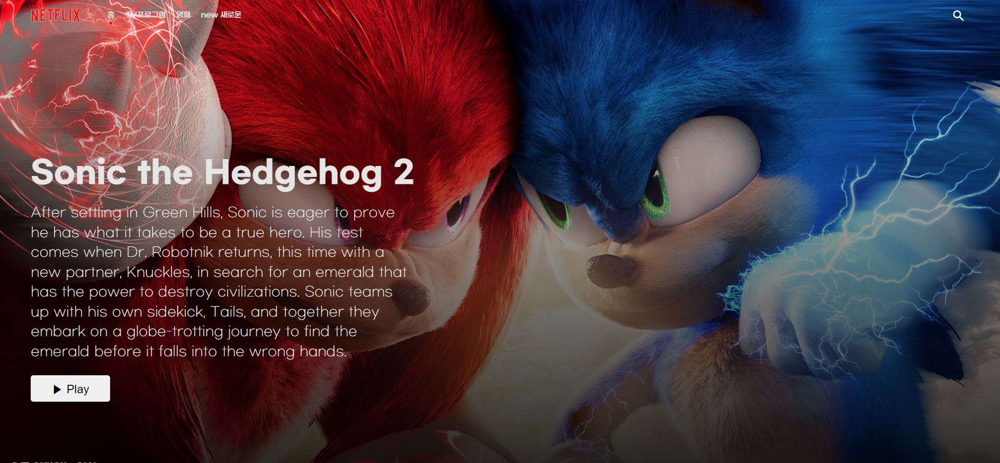

# 개발자에 도전하는 웹디자이너

### ⚡ Technologies

### ✏ I'm learning :
   

### 😋another skills :
 

## 📚Portfolio 
TIL : https://github.com/kimtaerin66/TIL

<a>https://kimtaerin66.github.io/thecontents/</a></img>
</img>
</img>
